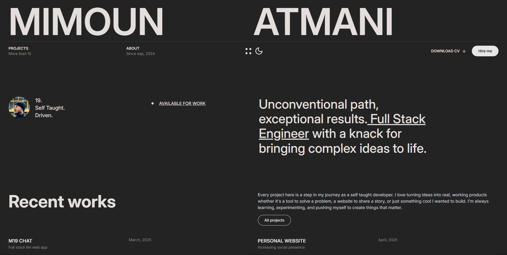
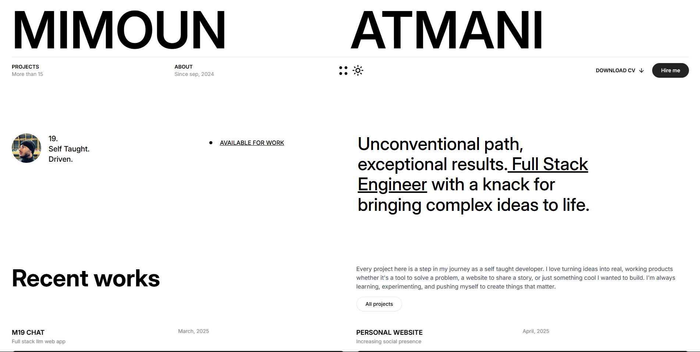

# Personal Portfolio

[](https://reactjs.org/)
[](https://www.typescriptlang.org/)
[](https://tailwindcss.com/)
[](https://vitejs.dev/)

## Introduction

A modern, responsive portfolio website showcasing my expertise as a Full Stack Engineer. The site features responsive design, smooth animations, theme customization, and comprehensive project case studies.

**[View Live Project](https://mimoun.xyz)**

## Design System

The interface implements a cohesive design system featuring both light and dark modes:

<div align="center">
  
  
</div>

## Strategic Objectives

This platform serves as:

- **Professional Portfolio** — Comprehensive presentation of skills, methodologies, and technical capabilities
- **Market Differentiation** — Provides a distinctive online presence with refined interactions and visual design
- **Project Documentation** — Features in-depth case studies of implemented solutions and technical challenges
- **Professional Presence** — Establishes credibility beyond traditional résumé formats

## Technical Architecture

### Core Technologies

- **Frontend Framework:** React 18 with TypeScript
- **UI Components:** Tailwind CSS, Shadcn component library
- **Animation Systems:** React Spring, Motion React
- **Navigation:** React Router v7
- **Scroll Management:** Lenis
- **Build System:** Vite

### Key Implementation Features

- Responsive design patterns ensuring optimal display across device formats
- Seamless theme transitioning with persistent state management
- Detailed project case studies with technical implementation specifics
- Interactive professional journey visualization
- Performance-optimized asset loading and rendering
- Content management through structured JSON data architecture

## Repository Structure

```
/src
├── components/    # Reusable UI component library
├── pages/         # Primary page compositions
├── assets/        # Static resources (images, icons)
├── context/       # React context providers
├── utils/         # Utility functions and helpers
└── data/          # Content and configuration files
```

## Contact Information

For inquiries regarding collaboration or employment opportunities:

- **Email:** mimounb1597@gmail.com
- **LinkedIn:** [Mimoun Atmani](https://www.linkedin.com/in/mimoun-atmani/)

---

© 2024 Mimoun Atmani. All rights reserved.
